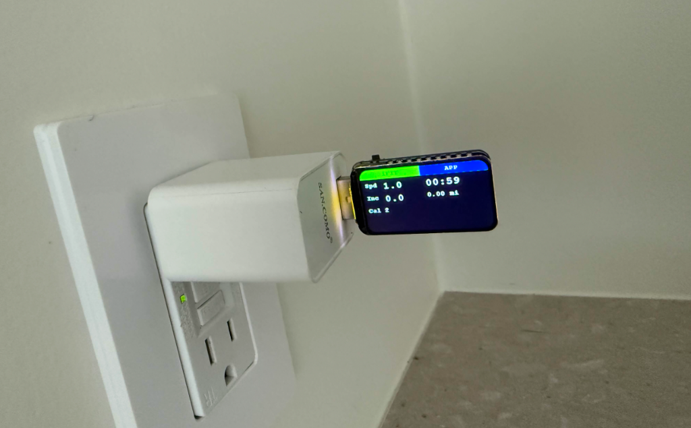

# Treadmill Connect (iFit to Runna/Zwift Bridge)

**Unlock your iFit treadmill and set it free!** 🔓🏃‍♂️

Treadmill Connect is a simple program that lets you use your iFit-locked treadmill with any fitness app you want—specifically verified with **Runna**, but should also work with **Zwift**, **Peloton**, or **Kinomap**.

## ⚠️ Disclaimer

This project is open-source and provided "as-is" without any warranty or official support. Use at your own risk.
 
## 🚧 Current Status
> [!NOTE]
> **Use the Python Program (Laptop) for best results.**
> *   ✅ **Python CLI (Laptop)**: Tested and Reliable with **Runna**. Recommended for daily use.
> *   ⚠️ **ESP32 Firmware**: **Work In Progress (Experimental)**. Currently experiencing connectivity issues ("Incompatible Device" errors) with some apps like Runna. We are actively debugging protocol timing issues. Use at your own risk.

## 🤔 How does it work?
Normally, iFit treadmills speak a "secret language" that only the iFit app understands. This program acts as a translator (a **Bridge**):
1.  It connects to your treadmill via Bluetooth and "unlocks" it (turning the light blue).
2.  It translates the treadmill's secret data into **FTMS** (Fitness Machine Service)—the standard language that all modern fitness apps speak.
3.  Your treadmill now looks like a generic smart treadmill to apps like Runna!

## ✨ What can it do?
-   **No Subscription Needed**: Works completely offline.
-   **Auto-Unlock**: Just run the program, and your treadmill wakes up.
-   **Works with Apps**: Verified with **Runna**. Experimental support for Zwift, etc.
-   **Live Dashboard**: Shows your Speed (MPH), Distance, and Incline right on your computer screen.
-   **Two-Way Control**:
    -   **Read**: Apps can see how fast you are running.
    -   **Control**: Apps (like Runna/Zwift) can *change* your treadmill's incline automatically when you run up a virtual hill!

## 📦 Easy Setup (Mac/Linux/Windows)

You need a computer with Bluetooth (a laptop is perfect).

1.  **Download this project.**
2.  **Open your Terminal.**
3.  **Install the tools:**
    ```bash
    make install
    ```
4.  **Run the Bridge:**
    ```bash
    make run
    ```
    *(If you don't have `make`, you can just type `python src/main.py`)*

## 🎮 How to Use
1.  **Turn on your treadmill.** (Make sure the iFit tablet app is CLOSED).
2.  **Run the command** (`make run`).
3.  Wait for the console light to turn **Blue** 🔵.
4.  Open **Runna** (Verified) or **Zwift** (Experimental) on your phone/tablet/computer.
5.  Search for a Running Device.
6.  Connect to **"mytm"**.
7.  **Run!** 🏃💨

## 🛠️ Advanced Options
-   **See what's happening under the hood**:
    ```bash
    make debug
    ```
-   **Test without a treadmill**:
    ```bash
    make mock
    ```

## 🛠️ CLI Options (Running on Laptop)

These options are for running the bridge on your computer (Mac/Linux/Windows).


-   **`--debug`**: Shows verbose logs (FTMS Notifications, Raw hex dumps) for debugging.
    ```bash
    python src/main.py --debug
    ```
-   **`--name "CustomName"`**: Change the advertised Bluetooth name (Default: `mytm`).
    ```bash
    python src/main.py --name "ZwiftRunner"
    ```
-   **`--mock`**: simulaton mode (no physical treadmill required).
    ```bash
    make mock
    ```

## ⚡ ESP32 Firmware (Standalone Bridge)
You can run this bridge on a standalone ESP32 microcontroller, removing the need for a laptop! Simply plug it in close to your treadmill, and it will work wirelessly.

### Prerequisites
-   **PlatformIO**: Install the VS Code extension or CLI (`pip install platformio`).

### Prerequisites
-   **PlatformIO**: Install the VS Code extension or CLI (`pip install platformio`).

### Commands
-   **Build Firmware**: `make esp-build`
-   **Flash Device**: `make esp-flash ENV=esp32-s3-geek` (Specify your board)
-   **Monitor Logs**: `make esp-monitor ENV=esp32-s3-geek`

**Available Environments:**
-   `esp32dev` (Generic ESP32)
-   `esp32-c3` (C3 Mini)
-   `esp32-s3-geek` (S3 Geek Dongle)

Once flashed, the ESP32 will automatically connect to your treadmill and advertise itself as `mytm`.




## 📂 For Developers
-   `src/`: The Python code powering the bridge.
-   `doc/`: Detailed notes on how we reverse-engineered the Bluetooth protocol (a fun read!).
-   `arch/`: [System Architecture & Data Flow Diagram](arch/system_architecture.md).

## 🔧 Troubleshooting
If the bridge isn't working or the connection seems unstable, you can run the direct connection test. This bypasses the FTMS server and connects directly to the treadmill to verify that your computer can "talk" to it.

```bash
make verify
```
This runs a pure verification script (`src/direct_connect.py`) that bypasses the complex FTMS server and connects directly to the treadmill. Use this to:
1.  **Verify Hardware**: Confirm your Bluetooth adapter can see and talk to the treadmill.
2.  **Test Controls**: Manually control the treadmill to ensure the proprietary handshake succeeded.

**Manual Controls (Verification Mode):**
-   `S` / `s`: Increase / Decrease Speed (0.1 MPH)
-   `I` / `i`: Increase / Decrease Incline (0.5 %)
-   `Q`: Quit

If controls work here but not in the App, the issue is likely in the "Translation/Bridge" layer. If they don't work here, the issue is with the Bluetooth connection or the Handshake.

## 🕵️‍♂️ Finding Your Device Name
This project is configured for a treadmill advertising as **`I_TL`**. If your treadmill has a different name:
1.  **Use a Scanner**: Download **nRF Connect** (Mobile) or use **PacketLogger** (macOS) to scan for your treadmill while it is unlocked.
2.  **Identify the Name**: Look for a device that appears when you turn the treadmill on.
3.  **Update Source**: Open `src/main.py` and `src/direct_connect.py` and change the `DEVICE_NAME` variable:
    ```python
    DEVICE_NAME = "My_Treadmill_Name"
    ```

## 📄 License
MIT License. See `LICENSE` for details.

## ⚠️ Disclaimer
This software is experimental. Use at your own risk. The authors are not affiliated with iFit or NordicTrack.
